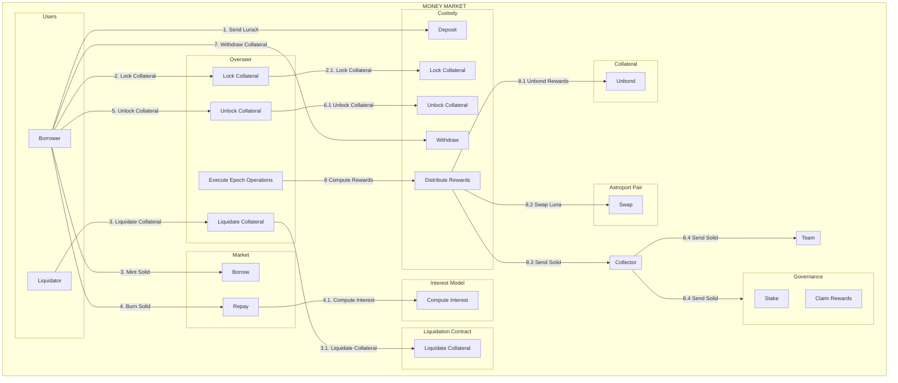

# Capapult Money Market Contracts
A Rust and [CosmWasm](https://cosmwasm.com/) implementation of the Capapult Protocol money market on the [Terra blockchain](https://terra.money).


## Contracts

| Contract | Reference |Description|
| ------------------------------------------------------ | ------------------------------------------------------------------------------------------ | ----------------------------------------------------------------------------- |
| [`oracle`](./contracts/oracle)  | smart-contracts/money-market/oracle | Provides a price feed for LSD collaterals |
| [`liquidation_queue`](./contracts/liquidation_queue)   | smart-contracts/money-market/liquidation_queue | Provides a queue for LSD collateral liquidations |
| [`custody_cw20`](./contracts/custody_cw20)  | smart-contracts/money-market/custody_bluna | Handles cw20 collaterals deposits and withdrawals |
| [`market`](./contracts/market)  | smart-contracts/money-market/market) | Handles SOLID borrows and repay |
| [`overseer`](./contracts/overseer)  | smart-contracts/money-market/overseer | Manages money market overalls, stores borrower information |


## Addresses

### mainnet Addresses

| Contract | Reference | Address|
| ------------------------------------------------------ | ------------------------------------------------------------------------------------------ | ----------------------------------------------------------------------------- |
| Capa cw20 | [`cw20`]([./contracts/oracle](https://github.com/CosmWasm/cw-plus/blob/main/packages/cw20/README.md)) | [terra1t4p3u8khpd7f8qzurwyafxt648dya6mp6vur3vaapswt6m24gkuqrfdhar](https://finder.terra.money/mainnet/address/terra1t4p3u8khpd7f8qzurwyafxt648dya6mp6vur3vaapswt6m24gkuqrfdhar)| 
|Solid cw20 | [`cw20`]([./contracts/oracle](https://github.com/CosmWasm/cw-plus/blob/main/packages/cw20/README.md)) | [terra10aa3zdkrc7jwuf8ekl3zq7e7m42vmzqehcmu74e4egc7xkm5kr2s0muyst](https://finder.terra.money/mainnet/address/terra10aa3zdkrc7jwuf8ekl3zq7e7m42vmzqehcmu74e4egc7xkm5kr2s0muyst)| 
| Marekt  | [`market`](./contracts/market) | [terra1h4cknjl5k0aysdhv0h4eqcaka620g8h69k8h0pjjccxvf9esfhws3cyqnc](https://finder.terra.money/mainnet/address/terra1h4cknjl5k0aysdhv0h4eqcaka620g8h69k8h0pjjccxvf9esfhws3cyqnc)| 
| Oracle | [`oracle`](./contracts/oracle) | [terra19z3qj8lwrhla6x58jt5338e3hktfrn6x63ua4226wk2c7psh62psfghzu7](https://finder.terra.money/mainnet/address/terra19z3qj8lwrhla6x58jt5338e3hktfrn6x63ua4226wk2c7psh62psfghzu7)|  
| Liquidation Queue | [`liquidation queue`](./contracts/liquidation_queue) | [terra188d4q69nen6vmwt7vcvz8lf54mc80cfvqtrznpmsrawftm86jkmsh4grzp](https://finder.terra.money/mainnet/address/terra188d4q69nen6vmwt7vcvz8lf54mc80cfvqtrznpmsrawftm86jkmsh4grzp)| 
| Custody LunaX | [`custody lunax`](./contracts/custody_cw20) | [terra18l7vt34kfy2ycv3aej4fgq286s060n55f7uz0qyw9jpzn5gszkxsy3r7nw](https://finder.terra.money/mainnet/address/terra18l7vt34kfy2ycv3aej4fgq286s060n55f7uz0qyw9jpzn5gszkxsy3r7nw)|
| Custody ampLuna | [`custody lunax`](./contracts/custody_cw20) | [terra18uxq2k6wpsqythpakz5n6ljnuzyehrt775zkdclrtdtv6da63gmskqn7dq](https://finder.terra.money/mainnet/address/terra18uxq2k6wpsqythpakz5n6ljnuzyehrt775zkdclrtdtv6da63gmskqn7dq)|
| Custody bLuna | [`custody lunax`](./contracts/custody_cw20) | [terra1fyfrqdf58nf4fev2amrdrytq5d63njulfa7sm75c0zu4pnr693dsqlr7p9](https://finder.terra.money/mainnet/address/terra1fyfrqdf58nf4fev2amrdrytq5d63njulfa7sm75c0zu4pnr693dsqlr7p9)| 
| Collector | [`collector`]([./contracts/oracle](https://github.com/capapult-finance/capa-token/tree/main/contracts/collector)) | [terra17tgwprenh90vymcrrz2u8s2pfcks6cfk3vvncvk5yxtggeshrvds7wqzya](https://finder.terra.money/mainnet/address/terra17tgwprenh90vymcrrz2u8s2pfcks6cfk3vvncvk5yxtggeshrvds7wqzya)| 
| Governance | [`governance`](https://github.com/capapult-finance/capa-token/tree/main/contracts/gov) | [terra1sf66d5vap897xlvv2hlcp4l20y4pp42r6ala4snk8mgd246jvufqwe0cnm](https://finder.terra.money/mainnet/address/terra1sf66d5vap897xlvv2hlcp4l20y4pp42r6ala4snk8mgd246jvufqwe0cnm)| 
| Overseer | [`overseer`](./contracts/overseer) | [terra10qnsw3wn4uaxs7en2kynhet2dsyy76lmprh2ptcz85d8hu59gkuqcpndnv](https://finder.terra.money/mainnet/address/terra10qnsw3wn4uaxs7en2kynhet2dsyy76lmprh2ptcz85d8hu59gkuqcpndnv)| 


### testnet Addresses (Not Updated)

| Contract | Reference | Address|
| ------------------------------------------------------ | ------------------------------------------------------------------------------------------ | ----------------------------------------------------------------------------- |
| Capa cw20 | [`cw20`]([./contracts/oracle](https://github.com/CosmWasm/cw-plus/blob/main/packages/cw20/README.md)) | [terra18v636fxjhjvjmcl88dm0vsg6v2m0vqhf78qh3864c52ccql2ffjqxnrnlj](https://finder.terra.money/mainnet/address/terra18v636fxjhjvjmcl88dm0vsg6v2m0vqhf78qh3864c52ccql2ffjqxnrnlj)| 
|Solid cw20 | [`cw20`]([./contracts/oracle](https://github.com/CosmWasm/cw-plus/blob/main/packages/cw20/README.md)) | [terra14gsu4x0zjfpx0uy7962htcwr9qc0sjzed7xps75tv7m24c6epkhqg2zlju](https://finder.terra.money/mainnet/address/terra14gsu4x0zjfpx0uy7962htcwr9qc0sjzed7xps75tv7m24c6epkhqg2zlju)| 
| Marekt  | [`market`](./contracts/market) | [terra1a25hrnt4wtxte29545q9ampnvw4f7730h4q3qecd0p2hg8say8wsyjdy7l](https://finder.terra.money/mainnet/address/terra1a25hrnt4wtxte29545q9ampnvw4f7730h4q3qecd0p2hg8say8wsyjdy7l)| 
| Oracle | [`oracle`](./contracts/oracle) | [terra14jwy43tj3wh6nsht0kw9sded4x630f2kfszl2s60z2fmq5v82pdsrylwek](https://finder.terra.money/mainnet/address/terra14jwy43tj3wh6nsht0kw9sded4x630f2kfszl2s60z2fmq5v82pdsrylwek)|  
| Liquidation Queue | [`liquidation queue`](./contracts/liquidation_queue) | [terra1mdwwr2ccynncjdcjuyhe7g755mcfleddlw8a7h2u26we40z62x9qmsy8cm](https://finder.terra.money/mainnet/address/terra1mdwwr2ccynncjdcjuyhe7g755mcfleddlw8a7h2u26we40z62x9qmsy8cm)| 
| Custody LunaX | [`custody lunax`](./contracts/custody_cw20) | [terra18l7vt34kfy2ycv3aej4fgq286s060n55f7uz0qyw9jpzn5gszkxsy3r7nw](https://finder.terra.money/mainnet/address/terra18l7vt34kfy2ycv3aej4fgq286s060n55f7uz0qyw9jpzn5gszkxsy3r7nw)|
| Custody ampLuna | [`custody lunax`](./contracts/custody_cw20) | [terra18uxq2k6wpsqythpakz5n6ljnuzyehrt775zkdclrtdtv6da63gmskqn7dq](https://finder.terra.money/mainnet/address/terra18uxq2k6wpsqythpakz5n6ljnuzyehrt775zkdclrtdtv6da63gmskqn7dq)|
| Custody bLuna | [`custody lunax`](./contracts/custody_cw20) | [terra1fyfrqdf58nf4fev2amrdrytq5d63njulfa7sm75c0zu4pnr693dsqlr7p9](https://finder.terra.money/mainnet/address/terra1fyfrqdf58nf4fev2amrdrytq5d63njulfa7sm75c0zu4pnr693dsqlr7p9)| 
| Collector | [`collector`]([./contracts/oracle](https://github.com/capapult-finance/capa-token/tree/main/contracts/collector)) | [terra17tgwprenh90vymcrrz2u8s2pfcks6cfk3vvncvk5yxtggeshrvds7wqzya](https://finder.terra.money/mainnet/address/terra17tgwprenh90vymcrrz2u8s2pfcks6cfk3vvncvk5yxtggeshrvds7wqzya)| 
| Governance | [`governance`](https://github.com/capapult-finance/capa-token/tree/main/contracts/gov) | [terra1vlt7s9hyltw906gxnl64kg7ztllf24xqz7w8ecxw3t0pywwamteqg8r4ve](https://finder.terra.money/mainnet/address/terra1vlt7s9hyltw906gxnl64kg7ztllf24xqz7w8ecxw3t0pywwamteqg8r4ve)| 
| Overseer | [`overseer`](./contracts/overseer) | [terra10qnsw3wn4uaxs7en2kynhet2dsyy76lmprh2ptcz85d8hu59gkuqcpndnv](https://finder.terra.money/mainnet/address/terra10qnsw3wn4uaxs7en2kynhet2dsyy76lmprh2ptcz85d8hu59gkuqcpndnv)| 

## Documentation




## Development

### Environment Setup

- Rust v1.44.1+
- `wasm32-unknown-unknown` target
- Docker

1. Install `rustup` via https://rustup.rs/

2. Run the following:

```sh
rustup default stable
rustup target add wasm32-unknown-unknown
```

3. Make sure [Docker](https://www.docker.com/) is installed.

### Unit / Integration Tests

Each contract contains Rust unit and integration tests embedded within the contract source directories. You can run:

```sh
cargo unit-test
```

### Compiling

After making sure tests pass, you can compile each contract with the following:

```sh
RUSTFLAGS='-C link-arg=-s' cargo wasm
cp ../../target/wasm32-unknown-unknown/release/cw1_subkeys.wasm .
ls -l cw1_subkeys.wasm
sha256sum cw1_subkeys.wasm
```

#### Production

For production builds, run the following:

```sh
docker run --rm -v "$(pwd)":/code \
  --mount type=volume,source="$(basename "$(pwd)")_cache",target=/code/target \
  --mount type=volume,source=registry_cache,target=/usr/local/cargo/registry \
  cosmwasm/workspace-optimizer:0.12.6
```

This performs several optimizations which can significantly reduce the final size of the contract binaries, which will be available inside the `artifacts/` directory.

## License

This repository is licensed under the Apache 2.0 license. See [LICENSE](./LICENSE) for full disclosure.

