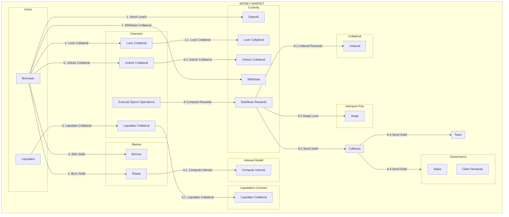

# Capapult Money Market Contracts
A Rust and [CosmWasm](https://cosmwasm.com/) implementation of the Capapult Protocol money market on the [Terra blockchain](https://terra.money).


## Contracts

| Contract | Reference |Description|
| ------------------------------------------------------ | ------------------------------------------------------------------------------------------ | ----------------------------------------------------------------------------- |
| [`oracle`](./contracts/oracle)  | smart-contracts/money-market/oracle | Provides a price feed for LSD collaterals |
| [`liquidation_queue`](./contracts/liquidation_queue)   | smart-contracts/money-market/liquidation_queue | Provides a queue for LSD collateral liquidations |
| [`custody_lunax`](./contracts/custody_bluna)  | smart-contracts/money-market/custody_bluna | Handles LunaX collateral deposits and withdrawals |
| [`market`](./contracts/market)  | smart-contracts/money-market/market) | Handles SOLID borrows and repay |
| [`interest_model`](./contracts/interest_model)  | smart-contracts/money-market/interest_model |Calculates the current borrow interest rate based on the market situation |
| [`overseer`](./contracts/overseer)  | smart-contracts/money-market/overseer | Manages money market overalls, stores borrower information |


## Addresses

### Testnet Addresses

| Contract | Reference | Address|
| ------------------------------------------------------ | ------------------------------------------------------------------------------------------ | ----------------------------------------------------------------------------- |
| Capa cw20 | [`cw20`]([./contracts/oracle](https://github.com/CosmWasm/cw-plus/blob/main/packages/cw20/README.md)) | [terra1a4ks4uh5sln95gvjfh938dy8c98lmzzfd2c6crup5jaeumupe5pqrprjvu](https://finder.terra.money/testnet/address/terra1a4ks4uh5sln95gvjfh938dy8c98lmzzfd2c6crup5jaeumupe5pqrprjvu)| 
|Solid cw20 | [`cw20`]([./contracts/oracle](https://github.com/CosmWasm/cw-plus/blob/main/packages/cw20/README.md)) | [terra1fnn26z4nax3j8x87yvetctyanu757j022n9h2s6j3w7d5jt8cu4qasg94w](https://finder.terra.money/testnet/address/terra1fnn26z4nax3j8x87yvetctyanu757j022n9h2s6j3w7d5jt8cu4qasg94w)| 
| Marekt  | [`market`](./contracts/market) | [terra1x27af9yrzl7jslj6pt78dmfsplsyye5qq2rgyz7nqw7myuw8hzcsftsukv](https://finder.terra.money/testnet/address/terra1x27af9yrzl7jslj6pt78dmfsplsyye5qq2rgyz7nqw7myuw8hzcsftsukv)| 
| Oracle | [`oracle`](./contracts/oracle) | [terra1n0gqscjmpfpea60uuh5qrd4rk8tn944zcwdt098vyjcv39u3p4yq7acyp9](https://finder.terra.money/testnet/address/terra1n0gqscjmpfpea60uuh5qrd4rk8tn944zcwdt098vyjcv39u3p4yq7acyp9)| 
| Interest model | [`interest model`](./contracts/interest_model) | [terra1m3wk4u86h6md4r4qem5fg8ulux2csav0tgd5jv0zc9q9yldjfl5qzd6frh](https://finder.terra.money/testnet/address/terra1m3wk4u86h6md4r4qem5fg8ulux2csav0tgd5jv0zc9q9yldjfl5qzd6frh)| 
| Liquidation Queue | [`liquidation queue`](./contracts/liquidation_queue) | [terra15rd9a86u0xwphp4gnxuudwh45vnueesfccagf0srgyeg98t45yfslevy3y](https://finder.terra.money/testnet/address/terra15rd9a86u0xwphp4gnxuudwh45vnueesfccagf0srgyeg98t45yfslevy3y)| 
| Custody LunaX | [`custody lunax`](./contracts/custody_lunax) | [terra175dhqrvthaxzfcfxmhx0xefmrjz5xd4lh8f3hfqntjmsucty4mdsnta7vp](https://finder.terra.money/testnet/address/terra175dhqrvthaxzfcfxmhx0xefmrjz5xd4lh8f3hfqntjmsucty4mdsnta7vp)| 
| Collector | [`collector`]([./contracts/oracle](https://github.com/capapult-finance/capa-token/tree/main/contracts/collector)) | [terra1ffe4vx34u0vrq7ckk7r8zhwpxauwh4tlmqgfjxhta9a46vv5kqasv2cxe5](https://finder.terra.money/testnet/address/terra1ffe4vx34u0vrq7ckk7r8zhwpxauwh4tlmqgfjxhta9a46vv5kqasv2cxe5)| 
| Governance | [`governance`](https://github.com/capapult-finance/capa-token/tree/main/contracts/gov) | [terra1th8ekpapwaqsrez02a2kwx6enxgd7k5u56hddspdxc4mth8alcaqslwg00](https://finder.terra.money/testnet/address/terra1th8ekpapwaqsrez02a2kwx6enxgd7k5u56hddspdxc4mth8alcaqslwg00)| 
| Overseer | [`overseer`](./contracts/overseer) | [terra1p38ueh7yqdlafwlnxpt920tfn4h7ctd879lkwuwy3fy5c3cn3zfscm5l5q](https://finder.terra.money/testnet/address/terra1p38ueh7yqdlafwlnxpt920tfn4h7ctd879lkwuwy3fy5c3cn3zfscm5l5q)| 
| Solid-Luna LP | [`Astro Lp`]([./contracts/oracle](https://docs.astroport.fi/astroport/smart-contracts/astroport-factory)) | [terra1a6s22uz7u27ea3kazhjcdhftjr7dwj5ty4r9tpae80c6nmtj85usrku4q4](https://finder.terra.money/testnet/address/terra1a6s22uz7u27ea3kazhjcdhftjr7dwj5ty4r9tpae80c6nmtj85usrku4q4)| 


## Documentation




## Development

### Environment Setup

- Rust v1.44.1+
- `wasm32-unknown-unknown` target
- Docker

1. Install `rustup` via https://rustup.rs/

2. Run the following:

```sh
rustup default stable
rustup target add wasm32-unknown-unknown
```

3. Make sure [Docker](https://www.docker.com/) is installed.

### Unit / Integration Tests

Each contract contains Rust unit and integration tests embedded within the contract source directories. You can run:

```sh
cargo unit-test
```

### Compiling

After making sure tests pass, you can compile each contract with the following:

```sh
RUSTFLAGS='-C link-arg=-s' cargo wasm
cp ../../target/wasm32-unknown-unknown/release/cw1_subkeys.wasm .
ls -l cw1_subkeys.wasm
sha256sum cw1_subkeys.wasm
```

#### Production

For production builds, run the following:

```sh
docker run --rm -v "$(pwd)":/code \
  --mount type=volume,source="$(basename "$(pwd)")_cache",target=/code/target \
  --mount type=volume,source=registry_cache,target=/usr/local/cargo/registry \
  cosmwasm/workspace-optimizer:0.12.6
```

This performs several optimizations which can significantly reduce the final size of the contract binaries, which will be available inside the `artifacts/` directory.

## License

This repository is licensed under the Apache 2.0 license. See [LICENSE](./LICENSE) for full disclosure.

