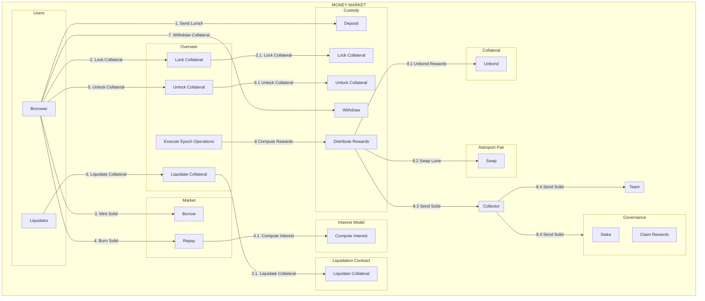

# Capapult Money Market Contracts
A Rust and [CosmWasm](https://cosmwasm.com/) implementation of the Capapult Protocol money market on the [Terra blockchain](https://terra.money).


## Contracts

| Contract | Reference |Description|
| ------------------------------------------------------ | ------------------------------------------------------------------------------------------ | ----------------------------------------------------------------------------- |
| [`oracle`](./contracts/oracle)  | smart-contracts/money-market/oracle | Provides a price feed for LSD collaterals |
| [`liquidation_queue`](./contracts/liquidation_queue)   | smart-contracts/money-market/liquidation_queue | Provides a queue for LSD collateral liquidations |
| [`custody_cw20`](./contracts/custody_cw20)  | smart-contracts/money-market/custody_bluna | Handles cw20 collaterals deposits and withdrawals |
| [`market`](./contracts/market)  | smart-contracts/money-market/market) | Handles SOLID borrows and repay |
| [`overseer`](./contracts/overseer)  | smart-contracts/money-market/overseer | Manages money market overalls, stores borrower information |


## Addresses

### mainnet Addresses

| Contract | Reference | Address|
| ------------------------------------------------------ | ------------------------------------------------------------------------------------------ | ----------------------------------------------------------------------------- |
| Capa cw20 | [`cw20`]([./contracts/oracle](https://github.com/CosmWasm/cw-plus/blob/main/packages/cw20/README.md)) | [terra1sp74507a9fn8clm6s62r2sl8t22x5lgqyvagserksycsqn7lj9kqnvl005](https://finder.terra.money/mainnet/address/terra1sp74507a9fn8clm6s62r2sl8t22x5lgqyvagserksycsqn7lj9kqnvl005)| 
|Solid cw20 | [`cw20`]([./contracts/oracle](https://github.com/CosmWasm/cw-plus/blob/main/packages/cw20/README.md)) | [terra1xmyxvkkrfwwaf84gydv6aff0pg4h50xlf5t9m89rjkdyhy60e9qqlkqvun](https://finder.terra.money/mainnet/address/terra103u503hvu7rexd2vlwcdr63d7875kynuwndjewrddn57fk75jw2qkzu2kl)| 
| Marekt  | [`market`](./contracts/market) | [terra103u503hvu7rexd2vlwcdr63d7875kynuwndjewrddn57fk75jw2qkzu2kl](https://finder.terra.money/mainnet/address/terra103u503hvu7rexd2vlwcdr63d7875kynuwndjewrddn57fk75jw2qkzu2kl)| 
| Oracle | [`oracle`](./contracts/oracle) | [terra1guvrwu6h9kq5w9dzlqftg4e6c35ywn9gsmueed50r6exzua560wqx9rt86](https://finder.terra.money/mainnet/address/terra1guvrwu6h9kq5w9dzlqftg4e6c35ywn9gsmueed50r6exzua560wqx9rt86)|  
| Liquidation Queue | [`liquidation queue`](./contracts/liquidation_queue) | [terra12qygrt6x3w5jpryae9lwhxpeamer7wz67hs3qq6ge79uc25f5c0quzzxud](https://finder.terra.money/mainnet/address/terra12qygrt6x3w5jpryae9lwhxpeamer7wz67hs3qq6ge79uc25f5c0quzzxud)| 
| Custody LunaX | [`custody lunax`](./contracts/custody_cw20) | [terra1sdwg4774d0lj4xrfwp099ff38ljrpmncj6hpz27mkmk3cgkvl6kqcyam7l](https://finder.terra.money/mainnet/address/terra1sdwg4774d0lj4xrfwp099ff38ljrpmncj6hpz27mkmk3cgkvl6kqcyam7l)|
| Custody ampLuna | [`custody lunax`](./contracts/custody_cw20) | [terra1wf40npm5kd6hv0vcha7tkv44yhk39sh8ym99q5p9tsr3759llnmsdcshpn](https://finder.terra.money/mainnet/address/terra1wf40npm5kd6hv0vcha7tkv44yhk39sh8ym99q5p9tsr3759llnmsdcshpn)|
| Custody bLuna | [`custody lunax`](./contracts/custody_cw20) | [terra1mkren5cdvvp33n4tyqsychlu5r483ts40t4v7xkh9kqs86z8k99sktuw6z](https://finder.terra.money/mainnet/address/terra1mkren5cdvvp33n4tyqsychlu5r483ts40t4v7xkh9kqs86z8k99sktuw6z)| 
| Collector | [`collector`]([./contracts/oracle](https://github.com/capapult-finance/capa-token/tree/main/contracts/collector)) | [terra17tgwprenh90vymcrrz2u8s2pfcks6cfk3vvncvk5yxtggeshrvds7wqzya](https://finder.terra.money/mainnet/address/terra17tgwprenh90vymcrrz2u8s2pfcks6cfk3vvncvk5yxtggeshrvds7wqzya)| 
| Governance | [`governance`](https://github.com/capapult-finance/capa-token/tree/main/contracts/gov) | [terra1zch9ygn40r6g0y7aj85djaxnkcrhglsmqj5gfqxxl7srgfful26sskflup](https://finder.terra.money/mainnet/address/terra1zch9ygn40r6g0y7aj85djaxnkcrhglsmqj5gfqxxl7srgfful26sskflup)| 
| Overseer | [`overseer`](./contracts/overseer) | [terra1vuau80hjjwnzr0z7hdeck47wey5cpev3hsmvn7nl9wq95n8d0tzscdyhdh](https://finder.terra.money/mainnet/address/terra1vuau80hjjwnzr0z7hdeck47wey5cpev3hsmvn7nl9wq95n8d0tzscdyhdh)| 

## Documentation




## Development

### Environment Setup

- Rust v1.44.1+
- `wasm32-unknown-unknown` target
- Docker

1. Install `rustup` via https://rustup.rs/

2. Run the following:

```sh
rustup default stable
rustup target add wasm32-unknown-unknown
```

3. Make sure [Docker](https://www.docker.com/) is installed.

### Unit / Integration Tests

Each contract contains Rust unit and integration tests embedded within the contract source directories. You can run:

```sh
cargo unit-test
```

### Compiling

After making sure tests pass, you can compile each contract with the following:

```sh
RUSTFLAGS='-C link-arg=-s' cargo wasm
cp ../../target/wasm32-unknown-unknown/release/cw1_subkeys.wasm .
ls -l cw1_subkeys.wasm
sha256sum cw1_subkeys.wasm
```

#### Production

For production builds, run the following:

```sh
docker run --rm -v "$(pwd)":/code \
  --mount type=volume,source="$(basename "$(pwd)")_cache",target=/code/target \
  --mount type=volume,source=registry_cache,target=/usr/local/cargo/registry \
  cosmwasm/workspace-optimizer:0.12.6
```

This performs several optimizations which can significantly reduce the final size of the contract binaries, which will be available inside the `artifacts/` directory.

## License

This repository is licensed under the Apache 2.0 license. See [LICENSE](./LICENSE) for full disclosure.

